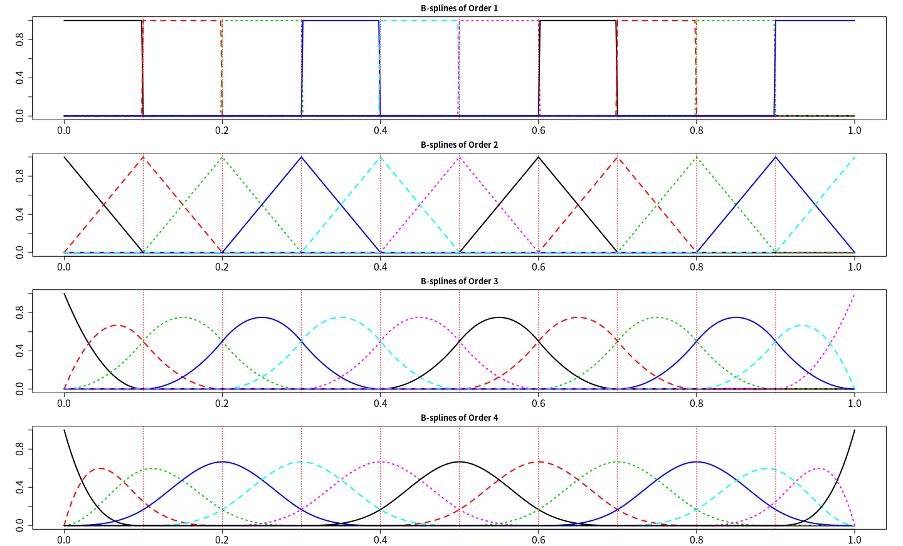
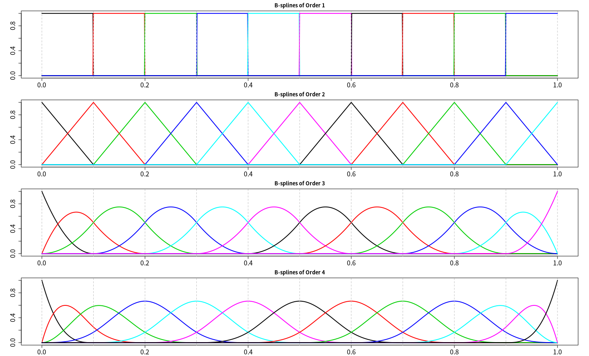
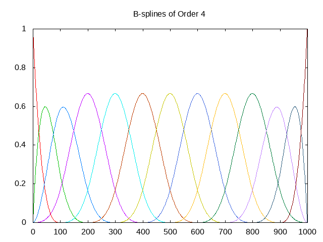
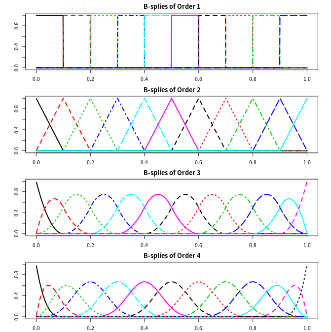

# B spline in R, C++ and Python

| 原文   | [第五章附录：B 样条的计算](../../05-Basis-Expansions-and-Regularization/Appendix-Computations-for-B-splines.md) |
| ---- | ---------------------------------------- |
| 作者   | szcf-weiya                               |
| 时间   | 2020-05-14 16:25:33                               |

在 Functional Data Analysis (FDA) 中，很重要的一步便是对原始数据进行光滑化，其中经常用到 B spline，而 FDA 有个很强大的 R package `fda`，里面就包含 B 样条的实现方法。

## Implement in R

```r
create.bspline.basis(rangeval=NULL, nbasis=NULL, norder=4,
      breaks=NULL, dropind=NULL, quadvals=NULL, values=NULL,
      basisvalues=NULL, names="bspl")
```

其中

- `rangeval` 为定义域，比如 `0:1` 即表示 `[0, 1]`
- `breaks` 为结点序列，包含边界结点，即必须满足 `breaks[1] = rangeval[1]` 和 `breaks[end] = rangeval[2]`.
- `nbasis` 为基函数个数，满足数量关系，

$$
\mathrm{nbasis} = \mathrm{nbreaks} + \mathrm{norder} - 2
$$

用 ESL 中的符号即为

$$
\mathrm{nbasis} = K + 2 + M - 2 = K+M\,,
$$

因为 knots 编号为 $\xi_0,\xi_1,\ldots,\xi_K,\xi_{K+1}$，其中 $\xi_0$ 和 $\xi_{K+1}$ 是边界结点。

```r
bbasis = vector("list", 4)
for (i in 1:4){
    bbasis[[i]] = create.bspline.basis(0:1, nbasis = 11 + i - 2, norder = i)
    # or
    # bbasis[[i]] = create.bspline.basis(0:1, breaks = seq(0, 1, by = 0.1), norder = i)
}
# or directly use the plot method
par(mfrow=c(4, 1), mar=c(2.1, 4.1, 2.1, 2.1))
for (i in 1:4){
    plot(bbasis[[i]], lwd = 2, cex.axis = 1.5)
    title(paste("B-splines of Order", i))
}
```



为了进一步理解样条函数，我们还可以自己对样条函数进行赋值，

```r
# reduce space gap between multiple graphs in R
# https://stackoverflow.com/questions/15848942/how-to-reduce-space-gap-between-multiple-graphs-in-r
par(mfrow=c(4, 1), mar=c(2.1, 4.1, 2.1, 2.1))
for (i in 1:4){
    bvals = eval.basis(0:1000*0.001, bbasis[[i]])
    matplot(0:1000*0.001, bvals, type = "l", lty = 1, lwd = 2, cex.axis = 1.5, xlab = "", ylab = "")
    abline(v=0:10*0.1, lty=2, lwd=1, col = "gray")
    title(paste("B-splines of Order", i))
}
```



如果不指定 `breaks`，只给出 `nbasis`，则结点是在定义域内均匀取点，但是有时候实际问题中可能想要在观测值多的地方多取点，而观测值少的地方少取点，这可以通过

```r
create.bspline.irregular(argvals,
      nbasis=max(norder, round(sqrt(length(argvals)))),
      norder=4,
      breaks=quantile(argvals, seq(0, 1, length.out=nbasis-norder+2)),
      dropind=NULL, quadvals=NULL, values=NULL,
      basisvalues=NULL, names="bspl", plot.=FALSE, ...)
```

实现，可以看到 `breaks` 是通过分位数来确定，所以满足刚刚提到的这种需求。当然，如果知道 `breaks`，完全可以直接用 `create.bspline.basis`，因为 `create.bspline.irregular` 最终也是要调用它的。

另外，`splines` 包的 `bs()` 也会返回 B 样条基函数赋值矩阵，类似于 `eval.basis()`，但不同的是，`bs()` 中的结点为内结点，而边界结点默认为赋值区域的两端，而且其有 `intercept` 参数，默认为 FALSE，表示将每个基函数的常数部分提出来然后合并在一起，如果是 TRUE，则每个基函数保留各自的常数部分，则得到的矩阵会多出一列。如果将其结果用于线性回归，则

```R
lm(y ~ 0 + bs(x, intercept=TRUE))
# or
lm(y ~ bs(x, intercept=FALSE))
```

默认为 FALSE 时，常数项被放到 `y ~ x` 中的截距项中去了，而 TRUE 时已经保留了常数项，则没必要再要求截距项，否则后面估计可能出现问题，比如出现 `NA`。

## Implement in Python

Python 中的 `scipy` 库也可以实现 B spline，具体函数为

```python
scipy.interpolate.BSpline(t, c, k, extrapolate=True, axis=0)
```

其中，

- `k`: degree，则 $M$ = `k` + 1
- `t`: 长度为 `n+k+1` 的结点序列，即 `n` + M, 其中定义域为 `t[k] .. t[n]`，这两个也刚好是边界结点. `t[0], t[1], ..., t[k-1]` 对应增广的结点序列 $\tau_1,\ldots, \tau_{M-1}$，而 `t[n+1], t[n+2], ..., t[n+k]` 对应 $\tau_{K+M+2},\ldots, \tau_{K+2M}$. 而且需注意到边界结点不再出现在增广结点序列中，即 $\xi_0, \xi_{K+1}$ 不会出现在 `t` 中，但一般 $\tau_{M} = \xi_0; \tau_{K+M+1} = \xi_{K+1}$, 所以 `t[k], t[k+1], ..., t[n]` 为基础结点序列（包含两个边界结点），$\xi_0,\xi_1,\ldots,\xi_K, \xi_{K+1}$，个数为 `n - k + 1` = K + M - `k` + 1 = K + 2
- `c`: 参数序列，长度为 `n`，实际中似乎可以大于 `n`，大概是只取前 `n` 个吧。

$$
S(x) = \sum_{j=0}^{n-1}c_jB_{j,k;t}(x)\,.
$$

从上面公式可以看出，这个函数并不像 R 里面的 `create.bspline.basis` 得到各个基函数，而是直接得到 B 样条的一个加权和，当然可以通过取 `c = [1, 0, 0, .., 0], [0, 1, 0, .., 0]` 这种特殊值来得到每个基函数。

不过，还是有函数可以自己返回单个基函数

```python
scipy.interpolate.BSpline.basis_element(t, extrapolate=True)
```

其中 `t` 是结点序列，长度为 `k+2`, 注意这里的结点序列只包含 support 的结点，回忆结论，

$$
x\not\in [\tau_i, \tau_{i+M}], B_{i,M} = 0\,,
$$

也就是说这里的 `t` 为 $\tau_{i}, \ldots,\tau_{i+M}$。注意到，这里每个基函数结点序列不一样，只包含各自不为零的结点序列，所以直接采用第一个函数得到全局的基函数会更方便。

```python
from scipy.interpolate import BSpline
import matplotlib.pyplot as plt
import numpy as np
fig, axes = plt.subplots(4, 1, figsize = (10, 8), sharex=True)
xx = np.arange(1001) * 0.001
# number of inner knots
K = 11 - 2
for degree in range(4):
    order = degree + 1
    n = order + K
    t = np.zeros(n + degree + 1)
    t[:order] = 0
    t[-order:] = 1
    # here if use degree, then need to discuss the case of degree = 0
    t[order:-order] = np.arange(1, K+1) * 0.1
    for i in range(0, n):
        c = np.zeros(n)
        c[i] = 1
        spl = BSpline(t, c, degree)
        axes[degree].plot(xx, spl(xx))
    axes[degree].title.set_text(f"B-splines of Order {order}")

plt.tight_layout(pad = 3.0)
plt.show()
```


## Implement in C++

C++ 中的[科学计算库 GSL](https://www.gnu.org/software/gsl/doc/html/bspline.html) 也提供了 B 样条的实现方法。定义结点序列为

$$
t = \{t_0, t_1,\ldots, t_{n+k-1}\}\,,
$$

其中 

- $t_0, \ldots, t_{k-1}$ 和 $t_{n}, \ldots, t_{n+k-1}$ 为增广序列
- $t_{k}, \ldots, t_{n-1}$ 为内结点序列，即 $K$ = `n` - `k` = n - M
- $t_{k-1}, t_{n}$ 为边界结点

这类似 Python 文档中的表述，但要注意这里 $k$ 是 order，而不是 degree。很直接的判断方法是看 B spline 的递推式，在 Python 中，递推式从 $B_{i,0}(x)$ 到 $B_{i,k}(x)$，而 GSL 的文档中从 $B_{i,1}(x)$ 到 $B_{i,k}(x)$，这与 ESL 中一致，所以从第二个脚标，可以发现 python 中 `k` 代表 degree，而 GSL 中代表 order.

拟合 B spline 的函数为

```cpp
# init
gsl_bspline_workspace * gsl_bspline_alloc(const size_t k, const size_t nbreak)
# construct knots
int gsl_bspline_knots(const gsl_vector * breakpts, gsl_bspline_workspace * w)
int gsl_bspline_knots_uniform(const double a, const double b, gsl_bspline_workspace * w)
# evaluation
int gsl_bspline_eval(const double x, gsl_vector * B, gsl_bspline_workspace * w)
int gsl_bspline_eval_nonzero(const double x, gsl_vector * Bk, size_t * istart, size_t * iend, gsl_bspline_workspace * w)
# free
gsl_bspline_free(gsl_bspline_workspace * w)
```

实现代码为，

```cpp
#include <iostream>
#include <cstdlib>
#include <gsl/gsl_bspline.h>
using namespace std;

int main(int argc, char *argv[])
{   
    size_t order = atoi(argv[1]);
    size_t nbreaks = 11;
    // number of data points
    size_t n = 1000;
    size_t ncoeffs = nbreaks + order - 2;
    gsl_bspline_workspace *bw;
    gsl_matrix *X;
    gsl_vector *B;
    size_t i, j;
    // alloc a order-k bspline workspace
    bw = gsl_bspline_alloc(order, nbreaks);
    X = gsl_matrix_alloc(n, ncoeffs);
    B = gsl_vector_alloc(ncoeffs);
    // use uniform breakpoints
    gsl_bspline_knots_uniform(0.0, 1.0, bw);
    for (i = 0; i < n; i++)
    {
        double xi = 1.0 * (i + 1) / n;
        // compute B_j(x_i) for all j
        gsl_bspline_eval(xi, B, bw);
        // fill in row i of X
        for (j = 0; j < ncoeffs; j++)
        {
            double Bj = gsl_vector_get(B, j);
            if (j != ncoeffs - 1)
                cout << Bj << "\t";
            else
                cout << Bj << endl;
            gsl_matrix_set(X, i, j, Bj);
        }
    }
    gsl_vector_free(B);
    gsl_matrix_free(X);
    gsl_bspline_free(bw);
    return 0;
}
```

画图一开始试了下 `gnuplot`，但是不是很熟悉，只是简单地得到了下图，

```bash
gnuplot -e "set term png; set output 'bsplines4.png'; set title 'B-splines of Order 4'; plot for [col=1:13] 'res.txt' using 0:col with lines notitle"
```



后来还是[采用 R 来调用 C++ 程序](https://darrenjw.wordpress.com/2010/12/30/calling-c-code-from-r/)，进而画图，

```r
bspline <- function (order = 4, tmpfile = tempfile(), exec = file.path(".", "bspline")){
    command = paste(exec, order, ">", tmpfile)
    system(command)
    read.table(tmpfile)
}

par(mfrow = c(4, 1), mar=c(2.1, 4.1, 2.1, 2.1))
for (order in 1:4) {
    data = bspline(order)
    matplot(1:1000*0.001, data, xlab = "", ylab = "", type = "l", lwd = 2)
    title(paste("B-splies of Order", order))
}
```


